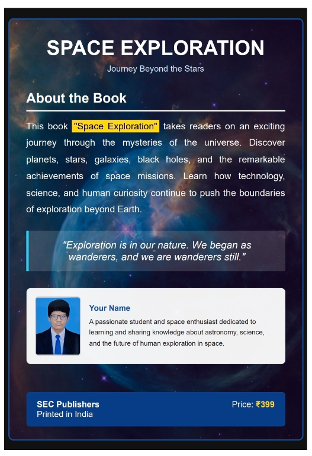

# Ex.05 Book Front Cover Page Design
## Date:23/05/2026

## AIM:
To design a book front cover page using HTML and CSS.

## DESIGN STEPS:

### Step 1:
Create a Django Admin project.

### Step 2:
Create an app in the Django interface.

### Step 3:
Create a folder named 'static' in the app folder.

### Step 4:
Create a new HTML file in the static folder.

### Step 5:
Write the HTML code with relevant CSS properties.

### Step 6:
Choose the appropriate style and color scheme.

### Step 7:
Insert the images in their appropriate places.

### Step 8:
Publish the website in the LocalHost.

## PROGRAM:
book.html
```<!DOCTYPE html>
<html lang="en">
<head>
<meta charset="UTF-8">
<meta name="viewport" content="width=device-width, initial-scale=1.0">
<title>Space Exploration Book Cover</title>

<style>
*{
    margin:0;
    padding:0;
    box-sizing:border-box;
    font-family:Arial, sans-serif;
}

body{
    display:flex;
    justify-content:center;
    align-items:center;
    min-height:100vh;
    background:#111;
}

.book-cover{
    width:700px;
    min-height:1000px;
    padding:40px;
    border:3px solid #0a4c9a;
    border-radius:12px;
    background:url("https://images.unsplash.com/photo-1462331940025-496dfbfc7564?w=1200")
    center/cover no-repeat;
    color:white;
    position:relative;
}

.overlay{
    position:absolute;
    inset:0;
    background:rgba(0,0,40,0.45);
    border-radius:10px;
}

.content{
    position:relative;
    z-index:1;
}

h1{
    text-align:center;
    font-size:48px;
    margin-bottom:10px;
    color:#fff;
}

.subtitle{
    text-align:center;
    font-size:20px;
    margin-bottom:40px;
    color:#d8e9ff;
}

.section-title{
    font-size:32px;
    margin-bottom:15px;
    border-bottom:3px solid #fff;
    padding-bottom:10px;
}

.description{
    font-size:22px;
    line-height:1.8;
    text-align:justify;
}

.highlight{
    background:gold;
    color:#000;
    padding:2px 5px;
}

.quote{
    margin-top:30px;
    background:rgba(255,255,255,0.15);
    border-left:5px solid #00d4ff;
    padding:20px;
    font-style:italic;
    font-size:24px;
    text-align:center;
}

.author-box{
    margin-top:40px;
    background:rgba(255,255,255,0.95);
    color:#222;
    padding:20px;
    border-radius:10px;
    display:flex;
    gap:20px;
    align-items:center;
}

.author-box img{
    width:120px;
    height:140px;
    object-fit:cover;
    border-radius:8px;
    border:2px solid #ccc;
}

.author-info h3{
    color:#0a4c9a;
    margin-bottom:8px;
}

.author-info p{
    line-height:1.6;
}

.footer{
    position:absolute;
    bottom:30px;
    left:40px;
    right:40px;
    background:#083d88;
    color:white;
    display:flex;
    justify-content:space-between;
    padding:18px 25px;
    border-radius:8px;
    font-size:20px;
}

.price{
    color:gold;
    font-weight:bold;
}
</style>
</head>

<body>

<div class="book-cover">
<div class="overlay"></div>

<div class="content">

<h1>SPACE EXPLORATION</h1>
<p class="subtitle">Journey Beyond the Stars</p>

<h2 class="section-title">About the Book</h2>

<p class="description">
This book <span class="highlight">"Space Exploration"</span>
takes readers on an exciting journey through the mysteries of the
universe. Discover planets, stars, galaxies, black holes, and the
remarkable achievements of space missions. Learn how technology,
science, and human curiosity continue to push the boundaries of
exploration beyond Earth.
</p>

<div class="quote">
"Exploration is in our nature. We began as wanderers,
and we are wanderers still."
</div>

<div class="author-box">
    
    
    <div class="author-info">
        <h3>Your Name</h3>
        <p>
            A passionate student and space enthusiast dedicated to
            learning and sharing knowledge about astronomy, science,
            and the future of human exploration in space.
        </p>
    </div>
</div>

</div>

<div class="footer">
    <div>
        <strong>SEC Publishers</strong><br>
        Printed in India
    </div>

    <div>
        Price: <span class="price">₹399</span>
    </div>
</div>

</div>

</body>
</html>
```


## OUTPUT:



## RESULT:
The program for designing book front cover page using HTML and CSS is completed successfully.
